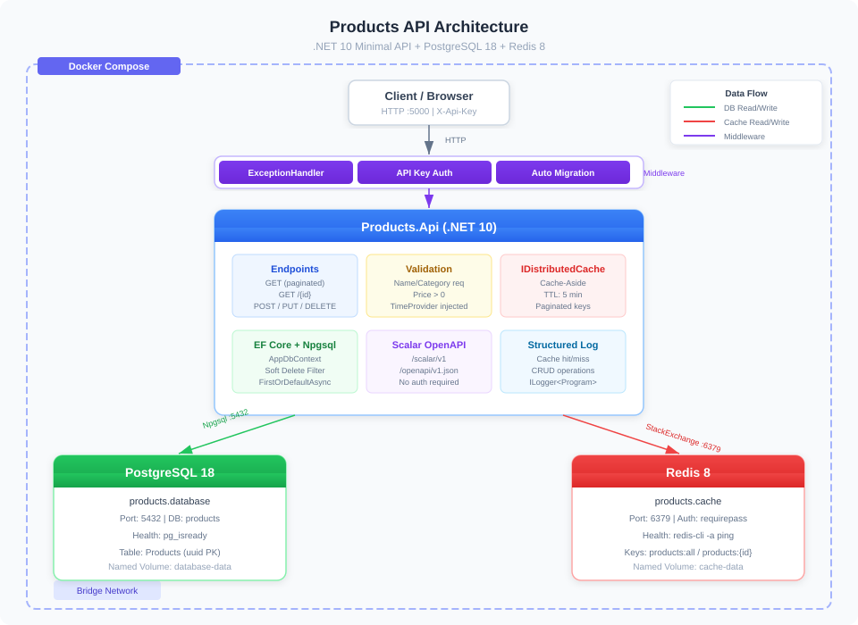

# Products API / 产品 API

A containerized .NET 10 Minimal API for product CRUD operations, backed by PostgreSQL 18 and Redis 8.

基于 .NET 10 Minimal API 的产品管理 CRUD 服务，使用 PostgreSQL 18 持久化 + Redis 8 缓存。



## Tech Stack

| Component | Technology | Version |
|-----------|-----------|---------|
| Runtime | .NET | 10 |
| Database | PostgreSQL (Alpine) | 18 |
| Cache | Redis (Alpine) | 8 |
| ORM | EF Core + Npgsql | 10 |
| Cache Provider | StackExchange.Redis + IDistributedCache | 2.x |
| API Docs | Scalar OpenAPI | 2.x |
| Auth | API Key Middleware (X-Api-Key) | - |
| Container | Docker Compose | - |

## Architecture

Three services on a shared Docker bridge network:

- **products.api** — .NET 10 Minimal API (port 5000 → 8080). Multi-stage Docker build. Waits for DB health check.
- **products.database** — PostgreSQL 18 Alpine. Named volume `database-data`. Health check via `pg_isready`.
- **products.cache** — Redis 8 Alpine with password auth. Named volume `cache-data`. Health check via `redis-cli -a ping`.

### Middleware Pipeline

```
Request → ExceptionHandler → API Key Auth → Endpoints
```

- **ExceptionHandler** — Returns `{ "error": "..." }` JSON for unhandled exceptions
- **API Key Auth** — Requires `X-Api-Key` header on all endpoints except `/openapi` and `/scalar`

### Cache Strategy

Cache-aside pattern with `IDistributedCache`. Keys include pagination params:

| Operation | Cache Key | TTL | Behavior |
|-----------|-----------|-----|----------|
| GET /products | `products:all:{page}:{pageSize}` | 5 min | Cache miss → query DB → cache result |
| GET /products/{id} | `products:{id}` | 5 min | Cache miss → query DB → cache result |
| POST /products | — | — | Insert DB, invalidate cache |
| PUT /products/{id} | — | — | Update DB, invalidate cache |
| DELETE /products/{id} | — | — | Soft delete, invalidate cache |

### Soft Delete

EF Core global query filter `HasQueryFilter(e => !e.IsDeleted)` excludes deleted products from all queries. Uses `FirstOrDefaultAsync` to ensure filter is always applied.

## Quick Start

```bash
# Start all services
docker compose up -d

# Rebuild after code changes
docker compose up -d --build

# Stop all services
docker compose down

# Stop and remove volumes
docker compose down -v
```

The API will be available at:
- HTTP: `http://localhost:5000`
- Scalar Docs: `http://localhost:5000/scalar/v1` (no API key required)
- OpenAPI JSON: `http://localhost:5000/openapi/v1.json`

## API Endpoints

All endpoints require `X-Api-Key` header except OpenAPI/Scalar docs.

| Method | Route | Description |
|--------|-------|-------------|
| `GET` | `/products` | List products (paginated, cached) |
| `GET` | `/products/{id}` | Get product by ID (cached) |
| `POST` | `/products` | Create a new product |
| `PUT` | `/products/{id}` | Update a product |
| `DELETE` | `/products/{id}` | Soft delete a product |

### Query Parameters (GET /products)

| Parameter | Type | Default | Description |
|-----------|------|---------|-------------|
| `page` | int | 1 | Page number (min 1) |
| `pageSize` | int | 20 | Items per page (1-100) |

## Example Requests

### List products

```bash
curl "http://localhost:5000/products?page=1&pageSize=5" \
  -H "X-Api-Key: dev-api-key-123"
```

### Create a product

```bash
curl -X POST http://localhost:5000/products \
  -H "Content-Type: application/json" \
  -H "X-Api-Key: dev-api-key-123" \
  -d '{
    "name": "Mechanical Keyboard",
    "description": "Cherry MX Brown switches, RGB backlight",
    "price": 149.99,
    "stock": 50,
    "category": "Peripherals"
  }'
```

### Get a product

```bash
curl http://localhost:5000/products/{id} \
  -H "X-Api-Key: dev-api-key-123"
```

### Update a product

```bash
curl -X PUT http://localhost:5000/products/{id} \
  -H "Content-Type: application/json" \
  -H "X-Api-Key: dev-api-key-123" \
  -d '{
    "name": "Mechanical Keyboard V2",
    "description": "Hot-swap sockets, PBT keycaps",
    "price": 169.99,
    "stock": 30,
    "category": "Peripherals"
  }'
```

### Delete a product (soft delete)

```bash
curl -X DELETE http://localhost:5000/products/{id} \
  -H "X-Api-Key: dev-api-key-123"
```

## Validation Rules

| Field | Rule |
|-------|------|
| Name | Required, max 200 chars |
| Description | Max 2000 chars |
| Price | Required, > 0 |
| Stock | >= 0 |
| Category | Required, max 100 chars |

## Product Entity

| Field | Type | Description |
|-------|------|-------------|
| Id | `Guid` | Primary key |
| Name | `string` | Product name (max 200) |
| Description | `string` | Product description (max 2000) |
| Price | `decimal` | Price (precision 18,2) |
| Stock | `int` | Available quantity |
| Category | `string` | Product category (max 100, indexed) |
| IsDeleted | `bool` | Soft delete flag |
| CreatedAt | `DateTime` | Creation timestamp (UTC) |
| UpdatedAt | `DateTime` | Last update timestamp (UTC) |

## Project Structure

```
Products.Api/
├── Cache/
│   └── CacheKeys.cs           # Cache key constants
├── Data/
│   └── AppDbContext.cs         # EF Core DbContext + soft delete filter
├── Endpoints/
│   └── ProductEndpoints.cs     # CRUD routes with caching, validation, logging
├── Middleware/
│   └── ApiKeyMiddleware.cs     # X-Api-Key authentication
├── Migrations/                 # EF Core migrations
├── Models/
│   └── Product.cs              # Entity + request DTOs
├── Dockerfile                  # Multi-stage Docker build
├── Program.cs                  # Startup + DI + middleware pipeline
└── Products.Api.csproj         # NuGet packages
```

## Configuration

Environment variables via `docker-compose.yml` (values from `.env`):

| Variable | Description | Default |
|----------|-------------|---------|
| `DB_DATABASE` | PostgreSQL database name | `products` |
| `DB_USER` | PostgreSQL username | `postgres` |
| `DB_PASSWORD` | PostgreSQL password | `postgres` |
| `CACHE_PASSWORD` | Redis requirepass | `STRONG_PASSWORD-123` |
| `API_KEY` | API key for endpoint auth | `dev-api-key-123` |
